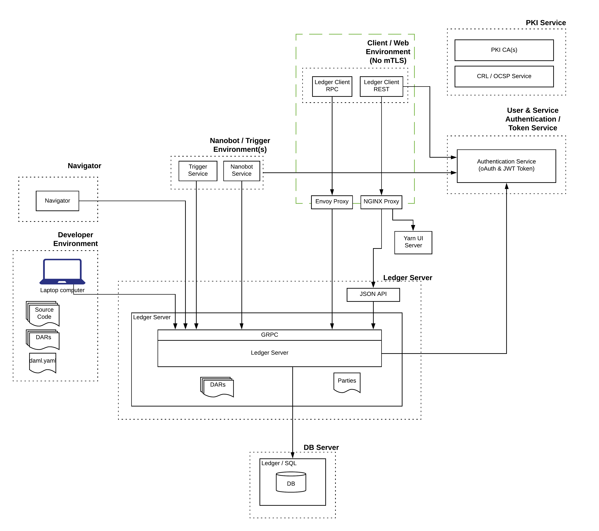
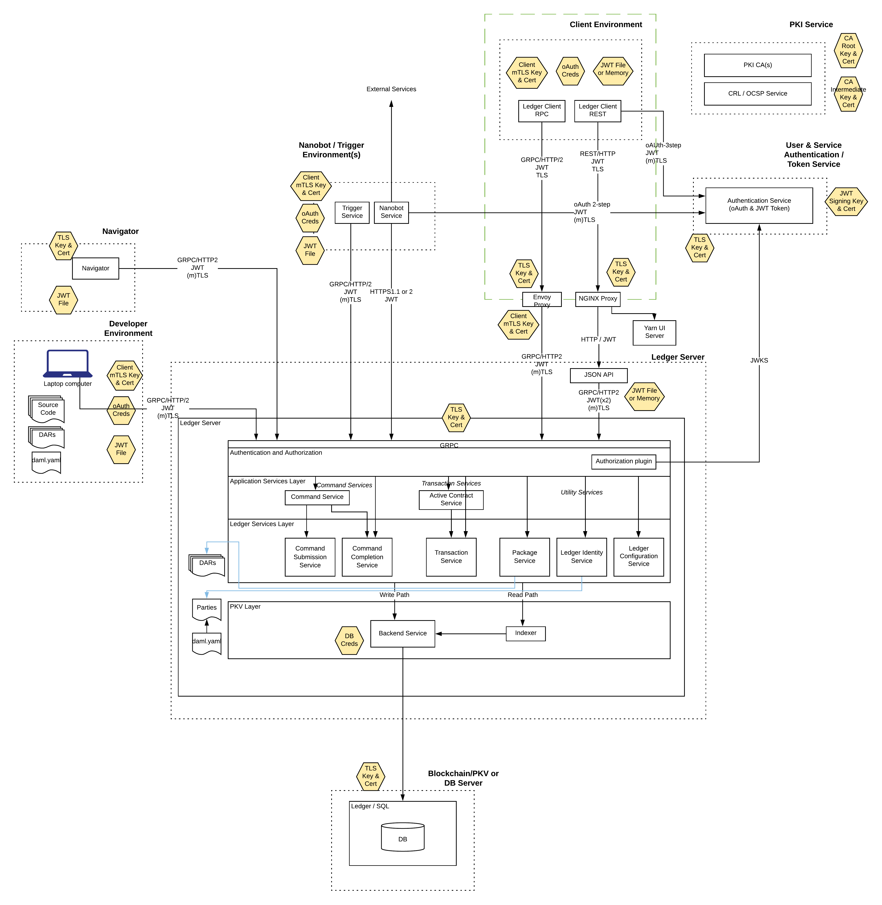

[](https://www.daml.com)

[](https://docs.daml.com/getting-started/installation.html)
[](https://github.com/digital-asset/daml/blob/master/LICENSE)

# Core Concepts

## Deployed Services

In this project we deploy the following services:
- A Ledger Server to host and execute the DAML Model
  - We use PostgresQL database as the persistence mechanism for this implementation.
  - DAML supports a wide variety of Blockchain implementations where a distributed deployments is required. This is out of scope of this project.
- A JSON API to allow REST calls to the Ledger service
- A Web application demonstrating user authentication and access. 
  - This is supported by NGINX and Envoy Proxies since, for this example, we do not expect end-users to use client certificate authentication to access applications.
- DAML Navigator to allow interaction with the active ledger
- Examples of automation services, including DAML Triggers, DAML Scripts and other bots

This is shown in the diagram below.



## Infrastructure Security 

The more detailed diagram below contains:
 - all security credentials and locations
 - connection protocols
 - detailed interior services within the Ledger Server



# Core Technologies

The reader is assumed to have some knowledge and experience with the technologies described. Where relevant, additional pointers
to other reading material is given.

## PKI, TLS and Client Certificates

Public Key Infrastructure is the set of hardware, software, policies and procedures that is require to create,
manage, distribute, use and revoke digital certificates. Certificates are the foundational for a set of technologies, enabling digital signatures and encryption, which in turn allow 
for digital identities.

An entity wanting to provide a validated digital identity will generate a public / private key pair and have the public portion signed, along with some metadata about the entity (i.e. name, location, rights), 
by a Certificate Authority to create a "certificate". All users who trust the authority can also validate and authenticate the identity. Certificate Authorities are required to perform 
varying levels of validation of the requester prior to issuing a certificate.

All data and transactions crossing a network need to be protected from unauthorised access or unauthorised changes - i.e. confidentiality and integrity. The standard
mechanism to achieve that is to use secure connections using the TLS protocol. For the majority of web servers it only
involves a TLS certificate on the destination to allow users to confirm they are connecting to the expected service. In many cases, the servers themselves will want to understand 
who is connecting and will require client applications to submit a client certificate. This enforces Mutual Authentication - both sides are able to validate who is connecting and 
that this is authorized.

Most commonly used browsers (Chrome, Safari, Firefox, Edge, etc) contain a set of "Trusted Root CAs" - a list of respected services that issue certificates
and have high standard of controls around the issuance and validation of these certificates. It is also possible for private PKI Certificate Authorities to be created 
and this is used here. This allows the system to restrict access to only valid certificates, created by this authority. 

Certificates are also used for digital signatures, whether that is code signing of binary applications or signing of data, in the case below of JSON Web Tokens to ensure they have not been 
altered or faked.

## Authentication Tokens, JWTs, JWKS

Once secure connectivity is in place, we need to authenticate and authorize applications to perform specific commands against the ledger. The Ledger uses the standard
JSON Web Token (JWT) to describe the actions the Party can take against the Ledger.

A JWT is a JSON formated token that is pass in the Authorization HTTP header. The token is the base64 encoded version of
the signed content consisting of a header (describes signing algorithm and key used), a payload (set of JSON attributes, some standard and additional custom claims), 
and the signature. Examples are provided below.

An authentication provider will publish a JWKS (JSON Web Key Set) that exposes the public key of the signing server. This
is used by backends to validate to the signature of the provided token for integrity. 

For Ledger Server we want to use RSA (or EC) asymetric encyrption to sign the tokens. JWT does support HS256 where a symetric secret is used but this is
open to attack via brute force password guessing.

An introduction to JWT is available here: [JWT Introduction](https://jwt.io/introduction/)
Full details of JWT, JWKS can be found in this handbook: [JWT Handbook](https://auth0.com/resources/ebooks/jwt-handbook)

### Example JWKS

Below is an example of a JWKS formatted key set. This is one produced by Auth0 and details the public certificate of the key used to sign RS256 JWT tokens.
Contents have been shortened for space.

This is by convention available from your authentication provider at the following URL:

```aidl
https://<authentication-provider-instance>/.well-known/jwks.json
```

The ```keys``` array details one or more certificates and each certificate is detailed. 
```aidl
{
  "keys": [
    {
      "alg": "RS256",
      "kty": "RSA",
      "use": "sig",
      "n": "<modulus of certificate>",
      "e": "AQAB",
      "kid": "QTBBQUI0MjFDODFCOEI3OTc2RTY2NDVDMTk0MUVGOTgwRkY3MjJDOA",
      "x5t": "QTBBQUI0MjFDODFCOEI3OTc2RTY2NDVDMTk0MUVGOTgwRkY3MjJDOA",
      "x5c": [
        "MIIDD<long public certificate>>"
      ]
    }
  ]
}
```

### Example JWT

The encoded JWT is the following. Normally this is one long string but it has been split into HEADER.PAYLOAD.SIGNATURE.
This string is added to the HTTP Header to authenticate the connection. 

```
Authorization: Bearer <token-string>
```
 
```aidl
eyJhbGciOiJSUzI1NiIsInR5cCI6IkpXVCIsImtpZCI6IlFUQkJRVUkwTWpGRE9ERkNPRUkzT1RjMlJUWT
JORFZETVRrME1VVkdPVGd3UmtZM01qSkRPQSJ9
.
eyJodHRwczovL2RhbWwuY29tL2xlZGdlci1hcGkiOns
ibGVkZ2VySWQiOiIyRDEwNTM4NC1DRTYxLTRDQ0MtOEUwRS0zNzI0OEJBOTM1QTMiLCJhY3RBcyI6WyJCb
2IiXSwicmVhZEFzIjpbIkJvYiJdLCJhZG1pbiI6ZmFsc2UsImFwcGxpY2F0aW9uSWQiOiJleC1zZWN1cmV
fZGFtbF9pbmZyYSJ9LCJpc3MiOiJodHRwczovL2RpZ2l0YWxhc3NldC1kZXYuYXV0aDAuY29tLyIsInN1Y
iI6IndGZ3c1MldaRllJWXl5MjNQdGZRT05jcFNRYVRXYVBpQGNsaWVudHMiLCJhdWQiOiJodHRwczovL2R
hbWwuY29tL2xlZGdlci1hcGkiLCJpYXQiOjE1OTcxMTQ1MTksImV4cCI6MTU5NzIwMDkxOSwiYXpwIjoid
0ZndzUyV1pGWUlZeXkyM1B0ZlFPTmNwU1FhVFdhUGkiLCJndHkiOiJjbGllbnQtY3JlZGVudGlhbHMifQ
.
j-MgjJnqoNJvQq51ysvQu8UJGT9jdn0poVdjluZMG9IGI4E3KHu1LukjzNRl2Y9LJz3S_m8QT-CXz-4pAx
gaRUvCexwT3IVZmmsOucttwYJbL9e0ok1zz0uyBTbYUzdcQG5RaIJlScjaxpxuQ359N_KAu5HO8fPhyqXu
-524hJOYeH5BJr6J9WuMwolwmMpT3HxxDffgue3v0rGUg3LxpO5IoKDtK9xcoApJ7ofj1PtDIXMNRdkAV1
xxCL_0N2OhorisiWfTjL0E_nwU6vC_5B_PWpFZHkRNRUOS2afwBKkGRa6joVvERWEIUkLJfrX0ckQubGCY
AAsRd10kIiawuA
```

After decoding (using ```./decode-jwt.sh <filename>```) it shows the Header and Payload portions as follows

```aidl
{
    "alg": "RS256",
    "kid": "QTBBQUI0MjFDODFCOEI3OTc2RTY2NDVDMTk0MUVGOTgwRkY3MjJDOA",
    "typ": "JWT"
}
{
    "aud": "https://daml.com/ledger-api",
    "azp": "wFgw52WZFYIYyy23PtfQONcpSQaTWaPi",
    "exp": 1597200919,
    "gty": "client-credentials",
    "https://daml.com/ledger-api": {
        "actAs": [
            "Bob"
        ],
        "admin": false,
        "applicationId": "ex-secure_daml_infra",
        "ledgerId": "2D105384-CE61-4CCC-8E0E-37248BA935A3",
        "readAs": [
            "Bob"
        ]
    },
    "iat": 1597114519,
    "iss": "https://digitalasset-dev.auth0.com/",
    "sub": "wFgw52WZFYIYyy23PtfQONcpSQaTWaPi@clients"
}
```
You can see that the JWT header has a reference to a ```kid``` (Key ID) that matches the key provided in the JWKS. 
Backend systems can then use the public key to validate the signature portion of the token. The JWT also has other standardized attributes:

| Tag    | Description                              |
|--------|------------------------------------------|
| alg    | Algorithm used for signing, here RS256   |
| aud    | Audience for token                       |
| azp    | Authorized Party                         |
| exp    | Expiry in Epoch seconds                  |
| gty    | Grant type                               |
| iat    | Issued at in Epoch seconds               |
| iss    | Issuer                                   |
| sub    | Subject (i.e account name)               |

The full list is available here: [IANA JWT attributes](https://www.iana.org/assignments/jwt/jwt.xhtml)

### DAML Ledger Custom Claims

The important part for the Ledger is the custom claim ```https://daml.com/ledger-api```. This details what the submitting 
application can do, including:

| Claim Field | Description |
|-------------|-------------|
| actAs | who they act as to submit commands (includes ReadAs claim) | 
| readAs | who they can read contracts as | 
| admin | perform administration actions against Ledger admin services | 
| ledgerId | the Ledger ID of the target Ledger | 
| applicationId | the application identifier (allows IAM to restrict a token to a specific service) | 
| participantId | the application identifier (restrict to a particular Partcipant Node for Distributed Ledgers) |
  

### Ledger Service Access Claim Requirements

| Ledger API service                  | Method                     | Access with                              |
|-------------------------------------|----------------------------|------------------------------------------|
| LedgerIdentityService               | GetLedgerIdentity          | isPublic                                 |
| ActiveContractsService              | GetActiveContracts         | for each requested party p: canReadAs(p) |
| CommandSubmissionService            | Submit                     | for submitting party p: canActAs(p)      |
| CommandCompletionService            | CompletionEnd              | isPublic                                 |
| CommandCompletionService            | CompletionStream           | for each requested party p: canReadAs(p) |
| CommandService                      | *                          | for submitting party p: canActAs(p)      |
| LedgerConfigurationService          | GetLedgerConfiguration     | isPublic                                 |
| PackageService                      | *                          | isPublic                                 |
| PackageManagementService            | *                          | isAdmin                                  |
| PartyManagementService              | *                          | isAdmin                                  |
| ResetService                        | *                          | isAdmin                                  |
| TimeService                         | GetTime                    | isPublic                                 |
| TimeService                         | SetTime                    | isAdmin                                  |
| TransactionService                  | LedgerEnd                  | isPublic                                 |
| TransactionService                  | *                          | for each requested party p: canReadAs(p) |

### Custom Token Formats and Claims

The above attributes are those enforced by the default Sandbox Ledger. It is possible for applications to provide their own Authentication Service
to accept custom token formats, different HTTP Headers, etc and allow other IAM providers that don't implement the OIDC Specification. 
Full details is available here: [DAML Authentication](https://docs.daml.com/app-dev/authentication.html)

This currently requires a recompilation of the Ledger to implement a custom Authorization service.  

The Scala source code for the Authorization Claims processing is [Here](https://github.com/digital-asset/daml/tree/master/ledger/ledger-api-auth/src/main/scala/com/digitalasset/ledger/api/auth). 

# Next Step

[Getting Started](./GettingStarted.md)

Copyright (c) 2020 Digital Asset (Switzerland) GmbH and/or its affiliates. All rights reserved.
SPDX-License-Identifier: Apache-2.0
